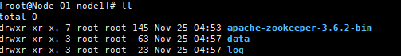

# Kafka安装配置,开发和原理剖析


## Kafka的安装与配置

* 安装zookeeper
文件

1. [zookeeper安装文件](./files/apache-zookeeper-3.6.2-bin.tar.gz)

2. 将安装文件解压
 

3. 创建日志文件夹和数据文件夹


4.修改配置文件(有原来的zoo_sample.cfg改成zoo.cfg)
[配置文件](./files/zoo.cfg)
```text
# The number of milliseconds of each tick
tickTime=2000
# The number of ticks that the initial 
# synchronization phase can take
initLimit=10
# The number of ticks that can pass between 
# sending a request and getting an acknowledgement
syncLimit=5
# the directory where the snapshot is stored.
# do not use /tmp for storage, /tmp here is just 
# example sakes.
dataDir=/usr/local/zookeeper/node1/data
dataLogDir=/usr/local/zookeeper/node1/log
# the port at which the clients will connect
clientPort=2181
server.1=192.168.253.3:2887:3887
server.2=192.168.253.3:2888:3888
server.3=192.168.253.3:2889:3889

# the maximum number of client connections.
# increase this if you need to handle more clients
#maxClientCnxns=60
#
# Be sure to read the maintenance section of the 
# administrator guide before turning on autopurge.
#
# http://zookeeper.apache.org/doc/current/zookeeperAdmin.html#sc_maintenance
#
# The number of snapshots to retain in dataDir
#autopurge.snapRetainCount=3
# Purge task interval in hours
# Set to "0" to disable auto purge feature
#autopurge.purgeInterval=1

## Metrics Providers
#
# https://prometheus.io Metrics Exporter
#metricsProvider.className=org.apache.zookeeper.metrics.prometheus.PrometheusMetricsProvider
#metricsProvider.httpPort=7000
#metricsProvider.exportJvmInfo=true


```

5. 启动各个节点
```text
 apache-zookeeper-3.6.2-bin/bin/zkServer.sh start apache-zookeeper-3.6.2-bin/conf/zoo.cfg 
```
* 安装kafka
1. 下载kafka安装包
[kafka安装包](https://kafka.apache.org/downloads)

2. 加压安装包

3. 添加日志或者数据的文件夹

4. 修改配置文件
[server.properties](./files/server.properties)
```text
# Licensed to the Apache Software Foundation (ASF) under one or more
# contributor license agreements.  See the NOTICE file distributed with
# this work for additional information regarding copyright ownership.
# The ASF licenses this file to You under the Apache License, Version 2.0
# (the "License"); you may not use this file except in compliance with
# the License.  You may obtain a copy of the License at
#
#    http://www.apache.org/licenses/LICENSE-2.0
#
# Unless required by applicable law or agreed to in writing, software
# distributed under the License is distributed on an "AS IS" BASIS,
# WITHOUT WARRANTIES OR CONDITIONS OF ANY KIND, either express or implied.
# See the License for the specific language governing permissions and
# limitations under the License.

# see kafka.server.KafkaConfig for additional details and defaults

############################# Server Basics #############################

# The id of the broker. This must be set to a unique integer for each broker.
broker.id=0

############################# Socket Server Settings #############################

# The address the socket server listens on. It will get the value returned from 
# java.net.InetAddress.getCanonicalHostName() if not configured.
#   FORMAT:
#     listeners = listener_name://host_name:port
#   EXAMPLE:
#     listeners = PLAINTEXT://your.host.name:9092
listeners=PLAINTEXT://192.168.253.3:9092

# Hostname and port the broker will advertise to producers and consumers. If not set, 
# it uses the value for "listeners" if configured.  Otherwise, it will use the value
# returned from java.net.InetAddress.getCanonicalHostName().
#advertised.listeners=PLAINTEXT://your.host.name:9092

# Maps listener names to security protocols, the default is for them to be the same. See the config documentation for more details
#listener.security.protocol.map=PLAINTEXT:PLAINTEXT,SSL:SSL,SASL_PLAINTEXT:SASL_PLAINTEXT,SASL_SSL:SASL_SSL

# The number of threads that the server uses for receiving requests from the network and sending responses to the network
num.network.threads=3

# The number of threads that the server uses for processing requests, which may include disk I/O
num.io.threads=8

# The send buffer (SO_SNDBUF) used by the socket server
socket.send.buffer.bytes=102400

# The receive buffer (SO_RCVBUF) used by the socket server
socket.receive.buffer.bytes=102400

# The maximum size of a request that the socket server will accept (protection against OOM)
socket.request.max.bytes=104857600


############################# Log Basics #############################

# A comma separated list of directories under which to store log files
log.dirs=/home/chendom/KAFKA/log

# The default number of log partitions per topic. More partitions allow greater
# parallelism for consumption, but this will also result in more files across
# the brokers.
num.partitions=1

# The number of threads per data directory to be used for log recovery at startup and flushing at shutdown.
# This value is recommended to be increased for installations with data dirs located in RAID array.
num.recovery.threads.per.data.dir=1

############################# Internal Topic Settings  #############################
# The replication factor for the group metadata internal topics "__consumer_offsets" and "__transaction_state"
# For anything other than development testing, a value greater than 1 is recommended to ensure availability such as 3.
offsets.topic.replication.factor=1
transaction.state.log.replication.factor=1
transaction.state.log.min.isr=1

############################# Log Flush Policy #############################

# Messages are immediately written to the filesystem but by default we only fsync() to sync
# the OS cache lazily. The following configurations control the flush of data to disk.
# There are a few important trade-offs here:
#    1. Durability: Unflushed data may be lost if you are not using replication.
#    2. Latency: Very large flush intervals may lead to latency spikes when the flush does occur as there will be a lot of data to flush.
#    3. Throughput: The flush is generally the most expensive operation, and a small flush interval may lead to excessive seeks.
# The settings below allow one to configure the flush policy to flush data after a period of time or
# every N messages (or both). This can be done globally and overridden on a per-topic basis.

# The number of messages to accept before forcing a flush of data to disk
#log.flush.interval.messages=10000

# The maximum amount of time a message can sit in a log before we force a flush
#log.flush.interval.ms=1000

############################# Log Retention Policy #############################

# The following configurations control the disposal of log segments. The policy can
# be set to delete segments after a period of time, or after a given size has accumulated.
# A segment will be deleted whenever *either* of these criteria are met. Deletion always happens
# from the end of the log.

# The minimum age of a log file to be eligible for deletion due to age
log.retention.hours=168

# A size-based retention policy for logs. Segments are pruned from the log unless the remaining
# segments drop below log.retention.bytes. Functions independently of log.retention.hours.
#log.retention.bytes=1073741824

# The maximum size of a log segment file. When this size is reached a new log segment will be created.
log.segment.bytes=1073741824

# The interval at which log segments are checked to see if they can be deleted according
# to the retention policies
log.retention.check.interval.ms=300000

############################# Zookeeper #############################

# Zookeeper connection string (see zookeeper docs for details).
# This is a comma separated host:port pairs, each corresponding to a zk
# server. e.g. "127.0.0.1:3000,127.0.0.1:3001,127.0.0.1:3002".
# You can also append an optional chroot string to the urls to specify the
# root directory for all kafka znodes.
zookeeper.connect=192.168.253.3:2181,192.168.253.3:2182,192.168.253.3:2183

# Timeout in ms for connecting to zookeeper
zookeeper.connection.timeout.ms=18000


############################# Group Coordinator Settings #############################

# The following configuration specifies the time, in milliseconds, that the GroupCoordinator will delay the initial consumer rebalance.
# The rebalance will be further delayed by the value of group.initial.rebalance.delay.ms as new members join the group, up to a maximum of max.poll.interval.ms.
# The default value for this is 3 seconds.
# We override this to 0 here as it makes for a better out-of-the-box experience for development and testing.
# However, in production environments the default value of 3 seconds is more suitable as this will help to avoid unnecessary, and potentially expensive, rebalances during application startup.
group.initial.rebalance.delay.ms=0
```
5. 启动kafka
```text
kafka_2.12-2.6.0/bin/kafka-server-start.sh -daemon kafka_2.12-2.6.0/config/server.properties 
```


## Kafka的开发

* 使用 kafka-clients框架开发
生产者
```text

import org.apache.kafka.clients.producer.KafkaProducer;
import org.apache.kafka.clients.producer.ProducerRecord;
import java.util.Properties;
public class KafkaProducerClient implements Runnable {
    private KafkaProducer kafkaProducer;
    public KafkaProducerClient() {
        Properties properties = new Properties();
        properties.put("bootstrap.servers", "192.168.253.3:9092");
        properties.put("acks", "all");
        properties.put("retries", 0);
        properties.put("batch.size", 20480);
        properties.put("linger.ms", 1);
        properties.put("buffer.memory", 2000000);
        //设置key的序列化类型
        properties.put("key.serializer", "org.apache.kafka.common.serialization.StringSerializer");
        //设置value的序列化类型
        properties.put("value.serializer", "org.apache.kafka.common.serialization.StringSerializer");
        this.kafkaProducer = new KafkaProducer(properties);
    }


    @Override
    public void run() {
        for (int i = 0; i < 100; i++) {
            System.out.println("message " + " key=" + i + " value=" + i);
            kafkaProducer.send(new ProducerRecord("message", "key=" + i, "value=" + i));
            try {
                Thread.sleep(1000);
            } catch (InterruptedException e) {
                e.printStackTrace();
            }
        }
        kafkaProducer.flush();
        kafkaProducer.close();
    }

    public static void main(String[] args) {
        new Thread(new KafkaProducerClient()).start();
    }
}
```
消费者:
```text
import org.apache.kafka.clients.consumer.ConsumerRecord;
import org.apache.kafka.clients.consumer.ConsumerRecords;
import org.apache.kafka.clients.consumer.KafkaConsumer;

import java.util.Arrays;
import java.util.Properties;

public class KafkaConsumerClient implements Runnable {
    private KafkaConsumer kafkaConsumer;

    public KafkaConsumerClient() {
        Properties properties = new Properties();
        properties.put("bootstrap.servers", "192.168.253.3:9092");
        properties.put("group.id", "test");
        properties.put("enable.auto.commit", "true");
        properties.put("auto.commit.interval.ms", "1000");
        // key的反序列化类型
        properties.put("key.deserializer", "org.apache.kafka.common.serialization.StringDeserializer");
        // 设置value的反序列化类型
        properties.put("value.deserializer", "org.apache.kafka.common.serialization.StringDeserializer");
        this.kafkaConsumer = new KafkaConsumer(properties);
    }

    @Override
    public void run() {
        //这个message代表了topics
        kafkaConsumer.subscribe(Arrays.asList("message"));
        while (true) {
            ConsumerRecords<String, String> records = kafkaConsumer.poll(100);
            for (ConsumerRecord<String, String> record : records) {
                System.out.printf("topic = %s,offset = %d, key = %s, value = %s%n", record.topic(), record.offset(), record.key(), record.value());

            }
        }
    }

 public static void main(String[] args) {
  new Thread(new KafkaConsumerClient()).start();
 }
}
```

* 使用spring-kafka开发

生产者
```text
@Component
public class KafkaProducer {
    @Resource
   public KafkaTemplate<String, String> kafkaTemplate;
}
-----------------------------------------------------------------------


```

消费者

```text
@Component
public class KafkaConsumer {
    @KafkaListener(topics = {"topic-test"})
    public void receiveMessage(String message) {
        System.out.println("consumer="+message);
    }
}
-----------------------------------------------------------------------

@RestController
@RequestMapping("/demo")
public class DemoController {

@Autowired
private KafkaProducer kafkaProducer;
@PostMapping("/send/{message}")
public void sendMessage(@PathVariable("message")String message){
if (StringUtils.isEmpty(message)){
    return;
}
kafkaProducer.kafkaTemplate.send("topic-test",message);
}
}
```


## srping-kafka的原理剖析

[源码地址](https://github.com/spring-projects/spring-kafka)

* 1 首先执行org.springframework.kafka.annotation.KafkaListenerAnnotationBeanPostProcessor.postProcessAfterInitialization方法,
这个方法主要是扫描所有注解@KafkaListener的类或者方法，将注解内的信息封装到了KafkaListenerEndpointDescriptor，并将KafkaListenerEndpointDescriptor
放入org.springframework.kafka.config.KafkaListenerEndpointRegistrar的集合变量org.springframework.kafka.config.KafkaListenerEndpointRegistrar.endpointDescriptors
进行维护.

* 2 执行org.springframework.kafka.config.KafkaListenerEndpointRegistrar类的org.springframework.kafka.config.KafkaListenerEndpointRegistrar.afterPropertiesSet()
这个方法主要是遍历所有的org.springframework.kafka.config.KafkaListenerEndpointRegistrar.endpointDescriptors并且为每个org.springframework.kafka.config.KafkaListenerEndpointRegistrar.endpointDescriptors
生产一个MessageListenerContainer


* 3 由于KafkaMessageListenerConatainer间接的实现了Leftcycle接口，所以start(),在这异步还创建了ListnerConsumer对象，该类实现了Runnable接口，实例化一个KafkaConsumer对象.

```text
	@Override
	public final void start() {
		checkGroupId();
		synchronized (this.lifecycleMonitor) {
			if (!isRunning()) {
				Assert.state(this.containerProperties.getMessageListener() instanceof GenericMessageListener,
						() -> "A " + GenericMessageListener.class.getName() + " implementation must be provided");
				doStart();
			}
		}
	}
------------------------------------------------------------------------------------------------------------------------
@Override
	protected void doStart() {
		if (isRunning()) {
			return;
		}
		if (this.clientIdSuffix == null) { // stand-alone container
			checkTopics();
		}
		ContainerProperties containerProperties = getContainerProperties();
		checkAckMode(containerProperties);

		Object messageListener = containerProperties.getMessageListener();
		if (containerProperties.getConsumerTaskExecutor() == null) {
			SimpleAsyncTaskExecutor consumerExecutor = new SimpleAsyncTaskExecutor(
					(getBeanName() == null ? "" : getBeanName()) + "-C-");
			containerProperties.setConsumerTaskExecutor(consumerExecutor);
		}
		GenericMessageListener<?> listener = (GenericMessageListener<?>) messageListener;
		ListenerType listenerType = determineListenerType(listener);
		this.listenerConsumer = new ListenerConsumer(listener, listenerType);
		setRunning(true);
		this.startLatch = new CountDownLatch(1);
		this.listenerConsumerFuture = containerProperties
				.getConsumerTaskExecutor()
				.submitListenable(this.listenerConsumer);
		try {
			if (!this.startLatch.await(containerProperties.getConsumerStartTimout().toMillis(), TimeUnit.MILLISECONDS)) {
				this.logger.error("Consumer thread failed to start - does the configured task executor "
						+ "have enough threads to support all containers and concurrency?");
				publishConsumerFailedToStart();
			}
		}
		catch (@SuppressWarnings(UNUSED) InterruptedException e) {
			Thread.currentThread().interrupt();
		}
	}


```


* 4 启动好ListenerConsumer线程，run()中调用了KafkaConsumer的poll()，实现了对消息的拉取.
```text
	public void run() { // NOSONAR complexity
			ListenerUtils.setLogOnlyMetadata(this.containerProperties.isOnlyLogRecordMetadata());
			publishConsumerStartingEvent();
			this.consumerThread = Thread.currentThread();
			setupSeeks();
			KafkaUtils.setConsumerGroupId(this.consumerGroupId);
			this.count = 0;
			this.last = System.currentTimeMillis();
			initAssignedPartitions();
			publishConsumerStartedEvent();
			Throwable exitThrowable = null;
			while (isRunning()) {
				try {
					pollAndInvoke();
				}
				catch (@SuppressWarnings(UNUSED) WakeupException e) {
					// Ignore, we're stopping or applying immediate foreign acks
				}
				catch (NoOffsetForPartitionException nofpe) {
					this.fatalError = true;
					ListenerConsumer.this.logger.error(nofpe, "No offset and no reset policy");
					exitThrowable = nofpe;
					break;
				}
				catch (AuthorizationException ae) {
					if (this.authorizationExceptionRetryInterval == null) {
						ListenerConsumer.this.logger.error(ae, "Authorization Exception and no authorizationExceptionRetryInterval set");
						this.fatalError = true;
						exitThrowable = ae;
						break;
					}
					else {
						ListenerConsumer.this.logger.error(ae, "Authorization Exception, retrying in " + this.authorizationExceptionRetryInterval.toMillis() + " ms");
						// We can't pause/resume here, as KafkaConsumer doesn't take pausing
						// into account when committing, hence risk of being flooded with
						// GroupAuthorizationExceptions.
						// see: https://github.com/spring-projects/spring-kafka/pull/1337
						sleepFor(this.authorizationExceptionRetryInterval);
					}
				}
				catch (FencedInstanceIdException fie) {
					this.fatalError = true;
					ListenerConsumer.this.logger.error(fie, "'" + ConsumerConfig.GROUP_INSTANCE_ID_CONFIG
							+ "' has been fenced");
					exitThrowable = fie;
					break;
				}
				catch (StopAfterFenceException e) {
					this.logger.error(e, "Stopping container due to fencing");
					stop(false);
					exitThrowable = e;
				}
				catch (Error e) { // NOSONAR - rethrown
					Runnable runnable = KafkaMessageListenerContainer.this.emergencyStop;
					if (runnable != null) {
						runnable.run();
					}
					this.logger.error(e, "Stopping container due to an Error");
					wrapUp(e);
					throw e;
				}
				catch (Exception e) {
					handleConsumerException(e);
				}
			}
			wrapUp(exitThrowable);
		}

------------------------------------------------------------------------------------------------------------------------
		protected void pollAndInvoke() {
			if (!this.autoCommit && !this.isRecordAck) {
				processCommits();
			}
			fixTxOffsetsIfNeeded();
			idleBetweenPollIfNecessary();
			if (this.seeks.size() > 0) {
				processSeeks();
			}
			pauseConsumerIfNecessary();
			this.lastPoll = System.currentTimeMillis();
			if (!isRunning()) {
				return;
			}
			this.polling.set(true);
			ConsumerRecords<K, V> records = doPoll();
			if (!this.polling.compareAndSet(true, false) && records != null) {
				/*
				 * There is a small race condition where wakeIfNecessary was called between
				 * exiting the poll and before we reset the boolean.
				 */
				if (records.count() > 0) {
					this.logger.debug(() -> "Discarding polled records, container stopped: " + records.count());
				}
				return;
			}
			resumeConsumerIfNeccessary();
			debugRecords(records);
			if (records != null && records.count() > 0) {
				savePositionsIfNeeded(records);
				notIdle();
				invokeListener(records);
			}
			else {
				checkIdle();
			}
		}
```


